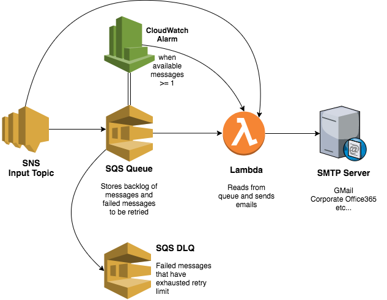

# ion

Microservice for reliably sending emails via an SNS topic using SMTP.

## Build infrastructure
### Package the lambda
`./release.sh`

### Terraform
`$ terraform init`  
`$ terraform plan`  
`$ terraform apply`  

## Configure
Edit `server/config.cfg` to change defaults  

Copy `server/config-secrets-example.cfg to server/config-secrets.cfg` and set the SMTP server, port and credentials.  

## Run locally
`cd server && ./run.sh`

## Architecture



1. SNS topic triggers the lambda when a message is sent through it
2. Lambda reads messages off the queue and sends emails using SMTP
3. SQS queue has an alarm that fires if the number of available messages is >= 1, which also triggers the lambda (in case the SNS-triggered lambda did not work through all the pending messages)
4. Lambda sets alarm state to `OK` before it closes, so that it will be re-triggered if there are still pending messages

Messages that fail to send will be retried automatically by SQS's visibility timeout, up to `maxReceiveCount` (at which point they go to the deadletter queue).

## How to use

Send an email by publishing a message to `ion-input-topic`:
```
{
	"action": "send",
	"recipient": "???",
	"subject": "Test email 1",
	"body": "This is a test email"
}
```

Redrive the deadletter queue by publishing:
```
{
	"action": "redrive"
}
```

## TODO
- Scaling (i.e., increase lambda concurrency limit)
- Put reserved concurrency into terraform (not currently supported)
- Reusable terraform module
- CloudWatch alarms for a large backlog of messages, and messages present in the deadletter queue
- Exponential backoff on failure, instead of just 60 seconds
- Persistent store of emails sent and failed attempts (DynamoDB?)
- Store failure reason with the message in the DLQ

